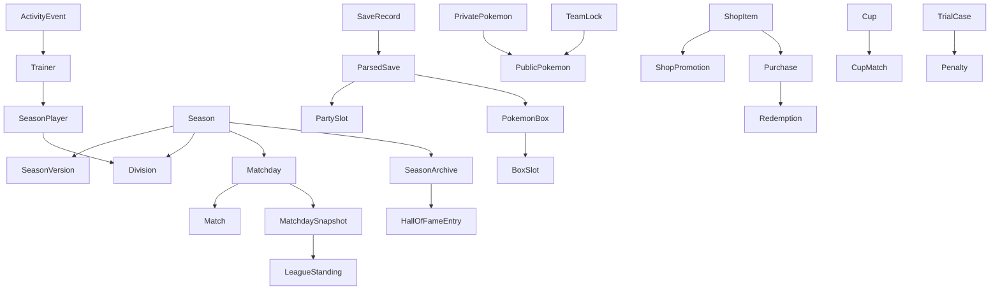

# PokeApp 2.0 Domain Contracts

Status: Fase 3

Date: 2026-08-15

Scope: data contracts only. This phase does not migrate runtime behavior,
ranking, rewards, purchases, parser, SQL, RLS, API, React, Cloudflare or Discord.

## Model Mechanism

Chosen mechanism:

- frozen `dataclasses`;
- `Enum(str, Enum)` for stable string enums;
- type aliases for IDs;
- small validation in `__post_init__`;
- dependency-free JSON serialization through `to_jsonable()`.

Why:

- the repo already uses dataclasses;
- no large modeling dependency is currently justified;
- dataclasses are easy to test and map to API/TypeScript DTOs;
- all contracts stay importable without Streamlit, storage, Supabase or parser
  runtime.

Rejected for now:

- Pydantic: not needed yet and would add a new dependency for static contracts.
- One huge `models.py`: rejected because the domain is already naturally split.
- Modeling the legacy JSON blobs directly: rejected because contracts must model
  PokeApp, not the historical implementation.

## Package Structure

```text
app/domain/
    __init__.py
    common.py
    trainers.py
    pokemon.py
    seasons.py
    league.py
    saves.py
    shop.py
    team_locks.py
    activity.py
    hall_of_fame.py
    cup.py
    trials.py
    archives.py
    legacy.py
```

`legacy.py` contains tiny dict-to-contract adapters for representative current
shapes. It does not import storage or UI. It is not used by the Streamlit app
yet.

Implemented adapters:

- `pokemon_from_legacy()`
- `season_version_from_legacy()`
- `trainer_status_from_legacy()`
- `activity_event_from_legacy()`
- `box_from_legacy()`
- `team_lock_from_legacy()`
- `matchday_snapshot_from_legacy()`

## Legacy Shape To Domain Map

| Legacy shape | Domain contract | Notes |
| --- | --- | --- |
| `settings.season_config_v2` | `SeasonVersion`, `SeasonRules`, `SeasonMetadata` | `effective_round` becomes `effective_matchday`. `cup_is_separate` is metadata, not active behavior. |
| `settings.league_state` | `Season`, `Matchday`, `Match`, `Division`, `MatchdaySnapshot` | No `LeagueStateJsonBlob` contract is created. |
| `league_state.round_snapshots` | `MatchdaySnapshot`, `LeagueStanding`, `PenaltySummary` | Official immutable closed jornada representation. |
| `settings.season_lifecycle_v1` | `Season.lifecycle` / `SeasonLifecycle` | `draft` is part of the target domain even if legacy UI starts active. |
| `settings.season_archives_v1` | `SeasonArchive` | Archive is historical and frozen, not the live season. |
| `settings.activity_events_v1` | `ActivityEvent` | Legacy uppercase event types map to snake_case enum values. |
| `settings.trainer_flags` status fields | `SeasonPlayer.status` / `TrainerStatus` | Status is season participation state, not global trainer identity. |
| `settings.trainer_flags.robbed` | `TrainerFlags` | Robbed remains a flag, not a status. |
| save parser dict | `ParsedSave`, `PrivatePokemon`, `PublicPokemon`, slots | Contracts do not contain PKHeX objects. |
| `saves` table | `SaveRecord` | Metadata persisted separately from parser output. |
| `team_locks` table | `TeamLock` | Team is frozen public Pokemon, not live save data. |
| shop catalog dict | `ShopItem` | Catalog definition, not a purchase. |
| `shop_discounts` table | `ShopPromotion` | Promotion stock/activation is separate from catalog. |
| `purchases` table | `Purchase` | Purchase is a persisted fact. |
| `redemptions` table | `Redemption` | Redemption is usage/canje, not purchase. |
| `hall_of_fame_v1` and archive Hall entries | `HallOfFameEntry` | Team is frozen public Pokemon. |
| `copa_*_state` | `Cup`, `CupMatch` | Minimal contract for current island. No new Copa behavior. |
| `juicios_state_v1` | `TrialCase`, `Penalty`, `JuryVote` | Minimal current behavior. No bigger judicial system. |

## Conceptual Diagram



## IDs

IDs are type aliases over `str` in `app/domain/common.py`.

Current contracts define:

- `TrainerId`
- `SeasonId`
- `SeasonVersionId`
- `DivisionId`
- `SeasonPlayerId`
- `MatchdayId`
- `MatchId`
- `PurchaseId`
- `RedemptionId`
- `SaveId`
- `TeamLockId`
- `ActivityEventId`
- `SeasonArchiveId`
- `HallOfFameEntryId`
- `CupId`
- `TrialId`
- `PokemonId`
- `ShopItemId`
- `ShopPromotionId`

No UUID migration happens in Fase 3. Future storage can use UUIDs without
changing the conceptual contracts.

## Common Value Objects And Enums

Defined in `app/domain/common.py`:

- `JsonValue` / `JsonObject`;
- `UtcTimestamp`;
- `Visibility`: `public`, `owner`, `admin`, `server_only`;
- `CompetitionType`: `league`, `cup`, `tournament`, `doubles_cup`;
- `to_jsonable()`.

Timestamp policy:

- domain contracts use UTC ISO-8601 strings;
- legacy epoch integers can be converted by adapters;
- runtime is not migrated yet.

JSON/API casing:

- contract field names use `snake_case`;
- enum values use stable lowercase snake_case;
- React/TypeScript should consume the same JSON names unless a later API layer
  deliberately maps them.

## Trainer

Module: `app/domain/trainers.py`

`Trainer` represents global identity:

- `id`
- `display_name`
- `avatar_url`
- `created_at`
- `metadata`

It does not contain current season status.

`TrainerStatus`:

- `active`: normal participant.
- `retired`: permanent administrative retirement.
- `abandoned`: abandoned the active season.
- `disqualified`: administrative inactive state.

`TrainerFlags`:

- `trainer_id`
- `robbed`
- `robbed_at`
- `robbed_by`
- `robbed_source`
- `note`

Robbed remains a functional flag. It is not a status.

Future Supabase:

- `trainers`: table entity.
- `trainer_flags`: table entity or season-scoped table.
- status should live in season participation, not global trainer identity.

## Season And SeasonPlayer

Module: `app/domain/seasons.py`

`Season`:

- `id`
- `name`
- `lifecycle`
- `active_version_id`
- timestamps: `created_at`, `started_at`, `finished_at`, `archived_at`,
  `discarded_at`

`SeasonLifecycle`:

- `draft`
- `active`
- `finished`
- `archived`
- `discarded`

Decision:

- `draft` belongs to the final domain because the planned start-of-season setup
  needs it, even though Streamlit legacy does not fully use it yet.

`SeasonPlayer` represents participation:

- `id`
- `season_id`
- `trainer_id`
- `status`
- `division_id`
- `joined_matchday`
- `left_matchday`
- `seed_order`
- `metadata`

This keeps global trainer identity separate from season-specific participation.

Future Supabase:

- `seasons`: table entity.
- `season_players`: table entity.

## SeasonVersion And Rules

`SeasonVersion`:

- `id`
- `season_id`
- `name`
- `effective_matchday`
- `max_matchdays`
- `participant_ids`
- `division_sizes`
- `promotion_relegation_count`
- `points_by_position`
- `coins_by_position`
- `rules`
- `metadata`

`SeasonRules` contains behavior-affecting rules:

- `team_lock_required`
- `last_b_gets_steal`

`SeasonMetadata` contains non-behavior config:

- `cup_is_separate`
- `notes`

Decision:

- `cup_is_separate` stays metadata because current code already keeps Copa
  separate and does not execute league behavior from this flag.

Future Supabase:

- `season_versions`: table entity.
- reward maps may be child rows or JSON depending on V2 design.

## Division

`Division`:

- `id`
- `season_id`
- `name`
- `tier_order`
- `metadata`

Decision:

- Runtime Streamlit 2.0 remains A/B only.
- The contract is not artificially limited to exactly two divisions, so future
  N divisions are not blocked.

Future Supabase:

- `divisions`: table entity.
- `division_players` or season player membership history may reference it.

## Matchday, Match And Standing

Module: `app/domain/league.py`

`Matchday`:

- `id`
- `season_id`
- `number`
- `status`
- `season_version_id`
- `opened_at`
- `closed_at`
- `snapshot_id`

`MatchdayStatus`:

- `planned`
- `open`
- `closed`
- `cancelled`

`Match`:

- `id`
- `matchday_id`
- `division_id`
- `trainer_a_id`
- `trainer_b_id`
- `status`
- `winner_trainer_id`
- `score`
- `metadata`

`MatchStatus`:

- `scheduled`
- `reported`
- `confirmed`
- `void`

`LeagueStanding`:

- `matchday_id`
- `trainer_id`
- `division_id`
- `position`
- `division_position`
- `points_awarded`
- `coins_awarded`
- `score`
- `penalties`
- `metadata`

`PenaltySummary` freezes the penalty effects relevant to standings:

- dead count and dead points;
- points reduction;
- coins reduction;
- store blocked;
- trainer status metadata.

Future Supabase:

- `matchdays`, `matches`, `league_standings`.

## MatchdaySnapshot

`MatchdaySnapshot` is one of the most important contracts.

It freezes:

- `schema_version`
- `matchday_id`
- `season_id`
- `matchday_number`
- `closed_at`
- full `season_version`
- `division_composition`
- `standings`
- `points_awarded`
- `coins_awarded`
- `penalties`
- `metadata`

Classification:

- Snapshot/document, probably stored as rows plus JSON or a dedicated
  `matchday_snapshots` table in Supabase V2.

Decision:

- It stores the applied `SeasonVersion`, not just an id, because historical
  standings must survive later config edits.

## Pokemon

Module: `app/domain/pokemon.py`

`PokemonMove`:

- `name`
- `move_id`
- `pp`

`PokemonFlags`:

- `dead`
- `shielded`
- `stolen`
- `revived`

`PublicPokemon`:

- `id`
- `species`
- `nickname`
- `level`
- `gender`
- `types`
- `item`
- `moves`
- `sprite_url`
- `form_name`
- `form_index`
- `is_shiny`
- `flags`
- `metadata`

`PrivatePokemon` extends the public shape with owner/admin fields:

- `ability`
- `nature`
- `ivs`
- `evs`
- `original_trainer`

Private fields:

- IVs;
- EVs;
- nature;
- ability;
- original trainer when treated as save-private context.

Decision:

- `PrivatePokemon.to_public()` is the explicit projection used to reason about
  future privacy/RLS. No PKHeX object appears in either contract.

## ParsedSave, Slots And Inventory

Module: `app/domain/saves.py`

`SaveRecord` is persisted metadata:

- `id`
- `trainer_id`
- `filename`
- `original_name`
- `sha256`
- `uploaded_at`
- `file_ref`
- `is_current`

`ParsedSave` is parser output:

- `schema_version`
- `save_record_id`
- `trainer_id`
- `party`
- `boxes`
- `inventory`
- `badges_count`
- `dead_count`
- `game_code`
- `parsed_at`
- `source_hash`
- `metadata`

`PartySlot`:

- `slot_number` from 1 to 6;
- optional `PrivatePokemon`.

`PokemonBox` and `BoxSlot`:

- `box_number` is 1-based;
- `slot_number` is 1-based;
- every box preserves all 30 slots, including empty slots.

Decision:

- `ParsedSave` cannot be a flat list of Pokemon because PC/Cajas needs real box
  order, slot order and empty slots.

`InventoryItem`:

- `item_id`
- `name`
- `quantity`
- `pocket`
- `category`
- `metadata`

Future Supabase/API:

- `saves`: table entity.
- parsed save can be cache/document output.
- parser boundary target remains:

```text
.sav/.dsv -> parser -> ParsedSave -> PokeApp
```

## TeamLock

Module: `app/domain/team_locks.py`

`TeamLock`:

- `id`
- `season_id`
- `trainer_id`
- `locked_at`
- `team`
- `matchday_id`
- `matchday_number`
- `save_record_id`
- `save_sha256`
- `deadline_at`
- `is_late`
- `metadata`

The team lock contract is intentionally linked to a matchday context and frozen
public team, not to the current live save.

Current implementation stores this in `team_locks`.

Future Supabase:

- `team_locks`: table entity.
- purchase/team lock critical operations should emit ActivityEvents server-side.

## Shop

Module: `app/domain/shop.py`

`ShopItem`:

- `id`
- `category`
- `name`
- `description`
- `base_price`
- `image_url`
- `enabled`
- `stock_rule`
- `metadata`

`ShopPromotion`:

- `id`
- `item_id`
- `season_id`
- `matchday_number`
- `kind`
- `base_price`
- `discount_price`
- `stock_total`
- `stock_used`
- `announced_at`
- `activates_at`
- `ends_at`
- `state`
- `dedupe_key`
- `metadata`

`PromotionKind`:

- `normal`
- `mega`

`PromotionState`:

- `pending`
- `active`
- `ended`

`Purchase`:

- `id`
- `trainer_id`
- `item_id`
- `item_name`
- `quantity`
- `unit_price`
- `total_price`
- `purchased_at`
- `status`
- `season_id`
- `matchday_number`
- `promotion_id`
- `base_unit_price`
- `metadata`

`PurchaseStatus`:

- `pending`
- `used`
- `cancelled`

`Redemption`:

- `id`
- `purchase_id`
- `trainer_id`
- `item_id`
- `item_name`
- `redeemed_at`
- `payload`

Decision:

- Catalog, promotion, purchase and redemption are separate concepts. The future
  purchase API should transact against `ShopPromotion`/`ShopItem` and emit a
  `Purchase`.

Future Supabase:

- `shop_items`, `shop_promotions`, `purchases`, `redemptions`.

## ActivityEvent And NotificationView

Module: `app/domain/activity.py`

`ActivityEvent`:

- `id`
- `type`
- `created_at`
- `actor_id`
- `trainer_id`
- `context`
- `payload`
- `visibility`
- `dedupe_key`
- `schema_version`

`ActivityEventType`:

- `save_uploaded`
- `purchase_completed`
- `team_locked`

Decision:

- Current legacy uppercase strings map to snake_case domain values.
- Future event types can be added later, but not in this phase.
- `NotificationView` is not domain. It is a view model/projection that belongs
  in application/UI code because it contains copy, labels and display limits.

Future Supabase/API:

- `activity_events`: append-only table.
- emitted server-side by save upload, purchase and team lock operations.

## SeasonArchive

Module: `app/domain/archives.py`

`SeasonArchive`:

- `id`
- `schema_version`
- `season_id`
- `label`
- `archived_at`
- `season_versions`
- `matchday_snapshots`
- `trainer_statuses`
- `champion_id`
- `runner_up_id`
- `champion_team`
- `cup_states`
- `hall_entries`
- `metadata`

Decision:

- `Season` is live.
- `SeasonArchive` is frozen historical representation.
- Champion team is public Pokemon only.

Classification:

- Snapshot/document. It may become a table plus child rows/documents in
  Supabase V2.

## Hall Of Fame

Module: `app/domain/hall_of_fame.py`

`HallOfFameEntry`:

- `id`
- `competition`
- `title`
- `champion_id`
- `created_at`
- `season_id`
- `archive_id`
- `runner_up_id`
- `frozen_team`
- `source`
- `notes`

Decision:

- No separate `HallOfFameTeam` class for now. A tuple of `PublicPokemon` is the
  cleanest current representation.
- Hall must not depend on live saves once an archive exists.

Future Supabase:

- `hall_of_fame`;
- optional `hall_of_fame_team` child table.

## Cup

Module: `app/domain/cup.py`

`Cup`:

- `id`
- `season_id`
- `format`
- `name`
- `player_ids`
- `current_round`
- `max_rounds`
- `configured`
- `champion_id`
- `hall_run_id`
- `metadata`

`CupFormat`:

- `swiss`
- `single_elimination`
- `doubles`

`CupMatch`:

- `id`
- `cup_id`
- `round_number`
- `participant_a_id`
- `participant_b_id`
- `winner_id`
- `score`
- `is_bye`
- `played_at`
- `metadata`

Decision:

- This is a minimal contract for current Copa state. It does not add new cup
  rules.

Future Supabase:

- `cups`, `cup_matches`, possibly `cup_teams` for doubles.

## Trials / Cases And Penalties

Module: `app/domain/trials.py`

`TrialCase`:

- `id`
- `season_id`
- `case_no`
- `title`
- `creator_id`
- `accused_id`
- `status`
- `verdict`
- `summary`
- `hearing_date`
- `is_public`
- `evidence`
- `witnesses`
- `priority`
- `category`
- `public_vote`
- `jury_size`
- `jury_votes`
- `resolution_notes`
- `penalties`
- timestamps
- `metadata`

`TrialStatus`:

- `proposed`
- `in_progress`
- `finished`

`TrialVerdict`:

- `pending`
- `guilty`
- `not_guilty`

`Penalty`:

- `type`
- `amount`
- `text`
- `start_matchday`
- `end_matchday`
- `metadata`

`PenaltyType`:

- `store_ban`
- `coins_reduction`
- `pokemon_release`
- `points_reduction`
- `other`

Decision:

- `Penalty` is a value object, not a standalone table entity for now.
- It can live inside `TrialCase` and be copied into `MatchdaySnapshot` effects
  through `PenaltySummary`.

Future Supabase:

- `trial_cases`;
- `trial_votes`;
- penalties as JSON or child rows depending on query needs.

## Privacy Matrix

| Data | Public | Owner | Admin | Server only |
| --- | --- | --- | --- | --- |
| Trainer display name | yes | yes | yes | no |
| Trainer PIN/credential | no | own change only | admin reset later if needed | yes |
| TrainerStatus | yes in competition contexts | yes | yes | no |
| TrainerFlags.robbed | yes in Liga/Tabla | yes | yes | no |
| PublicPokemon species/nickname/level/types/item/moves | yes when product exposes team | yes | yes | no |
| PrivatePokemon IVs | no | yes | yes | no |
| PrivatePokemon EVs | no | yes | yes | no |
| PrivatePokemon nature | no | yes | yes | no |
| PrivatePokemon ability | no | yes | yes | no |
| SaveRecord filename/original name | limited | yes | yes | no |
| SaveRecord storage path/ref | no | no direct UI | yes | yes |
| SaveRecord hash | no by default | limited | yes | yes |
| Purchase | visible as activity summary | own detail | yes | no |
| Redemption payload | no by default | own detail | yes | maybe |
| ActivityEvent public | yes | yes | yes | no |
| ActivityEvent owner | no | related trainer/actor | yes | no |
| ActivityEvent admin | no | no | yes | no |
| ActivityEvent server_only | no | no | no | yes |
| SeasonArchive champion public team | yes | yes | yes | no |

This matrix is conceptual. It does not implement RLS yet.

## Schema Versioning

Contracts that include `schema_version`:

- `ParsedSave`
- `MatchdaySnapshot`
- `SeasonArchive`
- `ActivityEvent`

Reason:

- these are serialized historical/parser/event documents where future migration
  compatibility matters.

Contracts without schema version:

- small table entities/value objects such as `Trainer`, `ShopItem`, `Penalty`.
  Their table/API schema will carry versioning later if needed.

## Validation Policy

Contracts validate only structural invariants:

- non-empty IDs;
- positive matchday/slot/position numbers;
- non-negative quantities/prices/rewards;
- promotion stock used cannot exceed stock total;
- purchase total equals quantity times unit price;
- Pokemon boxes must preserve all slots.

Contracts do not implement business rules such as:

- ranking;
- rewards;
- promotion/relegation;
- shop discount selection;
- purchase authorization;
- last Liga B stealing reward;
- lifecycle transitions.

Those belong to Fase 4+.

## Future Supabase V2 Classification

| Contract | Classification |
| --- | --- |
| Trainer | TABLE ENTITY |
| Season | TABLE ENTITY |
| SeasonPlayer | TABLE ENTITY |
| SeasonVersion | TABLE ENTITY / VERSIONED CONFIG |
| Division | TABLE ENTITY |
| Matchday | TABLE ENTITY |
| Match | TABLE ENTITY |
| LeagueStanding | SNAPSHOT ROW / DERIVED ROW |
| MatchdaySnapshot | SNAPSHOT/JSON plus possible child rows |
| PublicPokemon / PrivatePokemon | VALUE OBJECT / PARSED DTO |
| ParsedSave | SNAPSHOT/JSON / PARSER DTO |
| SaveRecord | TABLE ENTITY |
| InventoryItem | VALUE OBJECT / PARSED DTO |
| TeamLock | TABLE ENTITY |
| ShopItem | TABLE ENTITY |
| ShopPromotion | TABLE ENTITY |
| Purchase | TABLE ENTITY |
| Redemption | TABLE ENTITY |
| ActivityEvent | TABLE ENTITY, append-only |
| SeasonArchive | SNAPSHOT/JSON plus child rows |
| HallOfFameEntry | TABLE ENTITY |
| Cup | TABLE ENTITY |
| CupMatch | TABLE ENTITY |
| TrialCase | TABLE ENTITY |
| Penalty | VALUE OBJECT or child row later |
| NotificationView | VIEW MODEL, not domain |

## Future API Payloads

Likely request/response payloads:

- `SeasonVersion` for config changes.
- `SeasonPlayer` / TrainerStatus change request.
- `Matchday` close/open responses.
- `MatchdaySnapshot` close jornada response.
- `SaveRecord` upload response.
- `ParsedSave` parser output response or cache payload.
- `TeamLock` request/response.
- `ShopItem`, `ShopPromotion`, `Purchase`, `Redemption`.
- `ActivityEvent` list response.
- `SeasonArchive` archive response.
- `HallOfFameEntry` list response.
- `TrialCase` responses.

No endpoints are created in Fase 3.

## Contracts Deferred Or Classified Outside Domain

- `NotificationView`: view model/application projection.
- `HallOfFameTeam`: not needed; tuple of `PublicPokemon` is enough.
- N-division behavior: not implemented; only not blocked by `Division`.
- Parser internals: intentionally excluded.
- CSS/render components: outside domain.

## Decision Log

- Trainer identity is global; participation/status is season-specific.
- `robbed` is a flag, not a status.
- `Season` is live; `SeasonArchive` is frozen.
- `DRAFT` belongs to the target lifecycle.
- Streamlit runtime remains officially A/B, but `Division` contract is generic.
- `SeasonRules` only contains active behavior; `cup_is_separate` is metadata.
- `MatchdaySnapshot` stores applied config for immutable history.
- Public/private Pokemon are separate to prepare RLS.
- `ParsedSave` preserves slots and empty PC positions.
- Catalog, promotion, purchase and redemption are separate.
- TeamLock freezes public team data and save references; it does not point to
  live save data for rendering.
- ActivityEvent stores facts; NotificationView renders copy.
- Penalty is a value object for now.

## Tests

New contract tests:

- dependency-free domain modules;
- Season/SeasonVersion/Division/SeasonPlayer JSON serialization;
- Trainer vs SeasonPlayer vs TrainerFlags separation;
- PublicPokemon vs PrivatePokemon projection;
- PC box empty-slot preservation;
- legacy box adapter;
- MatchdaySnapshot JSON contract;
- legacy ActivityEvent mapping;
- ShopItem/ShopPromotion/Purchase separation and validation;
- TrialCase/Penalty value objects;
- Hall/Archive public frozen team;
- legacy snapshot adapter.
