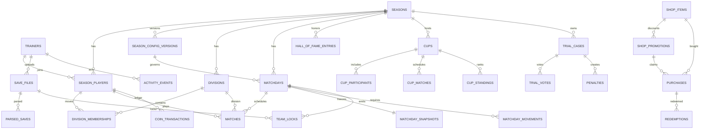

# Supabase V2 Greenfield Schema

Fase 6 disena PokeApp V2 como una base nueva. V1 queda solo como referencia de
comportamiento y lista de anti-patterns. No hay migracion general V1 -> V2 en
esta fase, no hay cutover y no se borra la base real actual.

## Principios

- SQL-first: una base vacia debe levantarse desde `supabase/v2/migrations`.
- Greenfield: no se heredan `settings` blobs ni columnas V1 como `"user"`,
  `jornada` o `tramo`.
- IDs estables: entidades principales usan UUID con `gen_random_uuid()`.
- `season_id` aparece en todo dato competitivo relevante.
- Relacional donde importa consultar/permisar; JSONB solo para snapshots,
  payloads y config flexible versionada.
- RLS esta implementado desde Fase 7: identity helpers, default-deny policies,
  vistas seguras y storage policies para `raw-saves`.
- Produccion futura: Supabase/Postgres sera la unica source of truth. SQLite solo
  queda para dev/test explicito si sigue aportando.

## Estructura

```text
supabase/v2/
  migrations/
    001_core.sql
    002_seasons.sql
    003_league.sql
    004_shop.sql
    005_saves.sql
    006_activity_hall.sql
    007_competitions.sql
    008_indexes.sql
    009_seed.sql
    010_security_helpers.sql
    011_rls_policies.sql
    012_security_views.sql
    013_storage_policies.sql
  reset_dev.sql
```

`reset_dev.sql` es destructivo y solo para desarrollo/staging. No debe ejecutarse
en produccion ni sobre la base V1 real.

## ER Conceptual



## Tablas

### Core

- `app_settings`: solo settings tecnicas/globales pequenas. No liga, no Hall, no
  saves, no trainer state.
- `trainers`: identidad global, `display_name`, `slug`, `auth_user_id`,
  `globally_enabled`. No puntos, no monedas, no division, no status de temporada.
- `seasons`: entidad real de temporada con status
  `draft|active|finished|archived|discarded` y timestamps.

Decision Auth: `trainers.auth_user_id` es `uuid unique` sin FK directa a
`auth.users`. Motivo: Supabase Auth es un schema gestionado y asi el SQL tambien
puede validarse en Postgres local. Fase 7 usa `auth.uid()` contra esta columna
mediante `current_trainer_id()`.

### Temporadas

- `season_players`: relacion N:M `trainers` <-> `seasons`. Aqui vive
  `status`: `active|retired|abandoned|disqualified`.
- `season_player_stats`: badges y pequenas stats season-scoped. No saldo.
- `trainer_flags`: flags de entrenador season-scoped como `robbed`. Separado de
  `season_players.status`.
- `pokemon_flags`: flags por Pokemon con `fingerprint`, season y owner.
- `season_config_versions`: reemplaza `season_config_v2`. Columnas normales para
  version, effective matchday, total matchdays, division count y movement count.
  JSONB para scoring, coin rewards y reglas flexibles.
- `divisions`: divisiones por temporada, con `code`, `name` y `tier_order`.

Decision TrainerStatus: vive en `season_players.status`, no en una tabla separada.
El historico de cambios se registra con `activity_events`/auditoria futura.

Decision badges: se usa `season_player_stats`, no `trainer_badges`, porque las
medallas pertenecen al contexto de una temporada competitiva.

### Liga

- `matchdays`: numero oficial de jornada, status y config version usada.
- `division_memberships`: historico de division por jugador con rango
  `effective_from_matchday_number` / `effective_to_matchday_number`.
- `matches`: partidos reales de PokeApp: division, jugador A/B, ganador, status.
- `matchday_snapshots`: snapshot oficial 1:1 por jornada cerrada. Admin recompute
  debe actualizar la fila e incrementar `revision`.
- `matchday_movements`: ascensos/descensos/stays oficiales consultables.

Decision standings: no se crea tabla `standings` live. La clasificacion abierta
se deriva desde matches/config/domain. La cerrada vive en `matchday_snapshots`.
Si React/API necesita rendimiento, se creara una view o cache reconstruible, no
una fuente de verdad prematura.

Decision config historica: `matchdays.season_config_version_id` congela que reglas
se aplicaron. Cambiar config futura no reinterpreta el pasado.

### Tienda y monedas

- `shop_items`: catalogo seedable en DB. Se elige DB porque precios/categorias y
  balance han cambiado con frecuencia.
- `shop_promotions`: reemplaza `shop_discounts`; incluye tipo normal/mega,
  status, precios efectivos, stock y tiempos.
- `purchases`: compra auditable de un solo item. No se crea `purchase_lines`.
- `redemptions`: canjes/usos separados de compras.
- `coin_transactions`: ledger firmado. El saldo se calcula como `sum(amount)`.

Decision ledger: no se guarda un saldo mutable como fuente unica. Cada reward,
compra, ajuste, penalizacion o compensacion debe generar un movimiento. Un balance
cacheado futuro tendria que poder reconstruirse desde el ledger.

Las compras promocionadas futuras deben reclamar stock atomico en API/RPC. La DB
ya protege `stock_used <= stock_total`, pero no duplica toda la logica de dominio
en triggers.

### Saves y Team Locks

- `save_files`: metadata SQL del save. Bytes raw fuera de Postgres.
- `parsed_saves`: cache JSONB por `save_file_id + parser_version`.
- `season_players.current_save_file_id`: reemplaza `settings.current_save:*`.
- `team_locks`: lock historico por `matchday_id + trainer_id`, con snapshot
  publico y snapshot privado opcional.

Decision current save: es season-scoped. Esto evita que una temporada nueva use
accidentalmente el save elegido en una temporada anterior.

Decision parsed saves: payload JSONB, no normalizacion stat/move/slot. El parser
es una caja negra y se debe poder reparsear con otra version sin tocar el raw save.

Storage: bucket esperado `raw-saves`, privado. `009_seed.sql` intenta crearlo si
existe el schema `storage`, usando SQL dinamico para que Postgres local lo omita.

### Actividad, Hall y archivo

- `activity_events`: append-only, con `visibility`, `dedupe_key`, `context` y
  `payload`.
- `hall_of_fame_entries`: entrada historica inmutable por temporada/competicion.
- `season_archive_snapshots`: snapshot final opcional de auditoria/export.

Decision SeasonArchive: V2 no necesita copiar media base al archivar. Archivar es
`seasons.status='archived'` y las relaciones con `season_id` conservan el
historico. `season_archive_snapshots` es solo documento final/audit/export.

Decision Hall: el equipo campeon sale de `team_snapshot`, no del save actual.

### Copa y Juicios

- `cups`: contenedor generico con `format`: swiss, elimination, doubles o manual.
- `cup_participants`: sides de Copa. Para dobles/equipos, metadata puede llevar
  miembros hasta que el producto necesite un modelo mas rico.
- `cup_matches`: matches genericos de Copa.
- `cup_standings`: standings auxiliares de Copa, especialmente Swiss.
- `trial_cases`: expedientes.
- `trial_votes`: votos si el flujo los usa.
- `penalties`: sanciones oficiales relacionables con season, trainer, matchday y
  trial case.

No se crean tablas distintas por Swiss/Elim/Dobles porque una estructura comun
soporta el producto actual sin inventar mecanicas.

## JSONB Policy

JSONB permitido:

- `season_config_versions.scoring_json`, `coin_rewards_json`, `rules_json`;
- `matchday_snapshots.snapshot`;
- `team_locks.public_team_snapshot` y `private_team_snapshot`;
- `parsed_saves.payload`;
- `redemptions.payload`;
- `activity_events.context/payload`;
- `hall_of_fame_entries.team_snapshot`;
- `season_archive_snapshots.snapshot`;
- metadata flexible.

JSONB no debe esconder:

- trainer identity;
- season participation/status;
- divisions and memberships;
- matchday number/status;
- matches/winners;
- purchases/redemptions;
- coin ledger;
- visibility/ownership fields.

## Inmutabilidad

Append-only o inmutable por politica de aplicacion:

- `activity_events`;
- `purchases`;
- `redemptions`;
- `coin_transactions`;
- closed `matchday_snapshots`;
- `team_locks` usados oficialmente;
- `hall_of_fame_entries`;
- archived seasons and archive snapshots.

Mutable:

- draft/active `seasons`;
- future `season_config_versions`;
- `season_players.status`;
- `trainer_flags` / `pokemon_flags`;
- pending/active `shop_promotions`;
- current save reference;
- open trials/cups.

## Delete Policy

- `trainers`: soft-disable con `globally_enabled=false`; no borrar historico.
- `seasons`: status, no hard delete normal.
- `season_players`: no delete normal; status inactive.
- `matches`, snapshots, purchases, redemptions, ledger, Hall: no delete normal.
- `save_files`: hard delete solo si no esta referenciado; si no, `deleted_at`.
- FKs usan `on delete restrict` por defecto para evitar cascadas destructivas.
- `on delete set null` solo en autores/actors donde preservar historico importa
  mas que bloquear una baja administrativa.

## RLS Readiness

Clasificacion inicial:

| Area | Clase |
| --- | --- |
| Trainers display, standings, Hall, public team snapshots | PUBLIC READ |
| Own save metadata, parsed private payload, private team snapshot | OWNER READ |
| Season config/admin actions/trainer status/trials | ADMIN |
| Raw save storage paths, parser payload completo sensible, credentials | SERVER ONLY |
| Activity events | Segun `visibility` |

Fase 7 materializo esta clasificacion en SQL:

- `010_security_helpers.sql` anade `trainers.is_admin` y helpers
  `current_auth_uid()`, `current_trainer_id()`, `is_current_user_admin()` y
  `current_user_owns_trainer(uuid)`.
- `011_rls_policies.sql` activa RLS en las 32 tablas V2, revoca acceso anon y
  aplica policies de owner/admin/default-deny.
- `012_security_views.sql` crea las vistas `public_*` y `current_*` que debe usar
  el cliente autenticado.
- `013_storage_policies.sql` protege `storage.objects` para el bucket privado
  `raw-saves` con rutas por `trainer_id`.

Regla operativa:

- el cliente debe leer desde vistas;
- las escrituras criticas de compras, ledger, redenciones, saves parseados,
  team locks y activity events quedan para API/RPC de Fase 8;
- `service_role` es solo backend/server;
- admin es `trainers.is_admin`, no un nombre hardcodeado.

Documento completo:

```text
docs/security-rls.md
```

## Transaction Candidates

Preparadas para API/RPC de Fase 8:

- promotional purchase stock claim;
- normal purchase + ledger + activity event;
- redemption + purchase status + effect flags;
- team lock upsert;
- close matchday + rewards + ledger + snapshot + movements;
- config version creation;
- trainer status change + activity event;
- finish/archive season + Hall finalize;
- save upload + metadata + parser queue/current save.

Fase 6 no mete todo el domain Python en PL/pgSQL. Las funciones SQL solo deben
existir cuando protejan integridad o atomicidad que no puede confiarse al cliente.

## Indexes And Constraints

`008_indexes.sql` anade indices por queries reales:

- active season;
- trainers slug;
- season players by season/status;
- config version effective lookup;
- matchdays by season/status;
- matches by matchday/division;
- promotions by season/matchday/status;
- purchases by trainer/date and item/status;
- ledger by trainer/date;
- saves by trainer/date and sha;
- team locks by matchday/trainer;
- activity recent and dedupe;
- trials/penalties by season/trainer.

Constraints importantes:

- one active season;
- trainer once per season;
- matchday number unique per season;
- team lock once per trainer/matchday;
- Hall entry once per season/competition;
- dedupe keys for activity/promotions;
- stock cannot exceed total;
- winner must be one of match players;
- prices and quantities are non-negative/positive as appropriate.

## SQLite Policy

Produccion V2: Supabase/Postgres only. SQLite no debe ser fallback silencioso.
Puede seguir existiendo en codigo legacy hasta Fase 11/15, pero V2 debe tratarlo
como dev/test explicito o eliminarlo cuando la nueva API este estable.

## Legacy Export

No hay migracion general V1 -> V2 porque la decision de producto es borrar V1 tras
validar una base limpia/staging. Si antes del borrado se quiere conservar algo,
habria que exportar explicitamente:

- saves raw + metadata;
- Hall entries;
- archives;
- purchases/redemptions;
- Pokemon/trainer flags;
- team locks;
- league snapshots.

Eso debe decidirlo el usuario antes del cutover, no esta asumido por Fase 6.

## Validation

Validacion incluida:

- `tests/test_supabase_v2_schema.py` comprueba migrations esperadas, tablas,
  IDs, season scoping, constraints criticas, ausencia de blobs V1 y reset
  destructivo separado.
- `tools/validate_supabase_v2_schema.py` ejecuta validacion real contra Postgres:
  reset V2, migrations 001-013, seed idempotente, reset, rebuild, fixtures de
  introspeccion/constraints y checks RLS con roles tipo Supabase.

### Real Database Validation

Fase 6.1 ejecuto el schema base contra una base real local aislada:

- Entorno: PostgreSQL 17.11 portable para Windows, descargado desde binarios EDB.
- Host: `127.0.0.1`.
- Puerto local: `55432`.
- Base temporal: `pokeapp_v2_validation`.
- Usuario: `postgres`.
- No se conecto a Supabase V1, no se ejecuto nada contra produccion y no se uso
  `reset_dev.sql` fuera de la base temporal.

Comando reproducible usado:

```powershell
py tools\validate_supabase_v2_schema.py `
  --psql "$env:TEMP\pokeapp_pg17_validation\pgsql\pgsql\bin\psql.exe" `
  --host 127.0.0.1 `
  --port 55432 `
  --user postgres `
  --database pokeapp_v2_validation `
  --allow-destructive-reset
```

Resultado:

- `reset_dev.sql` sobre base temporal: OK.
- Primera ejecucion `001_core.sql` -> `009_seed.sql`: OK.
- Segunda ejecucion de `009_seed.sql`: OK, sin duplicar seed.
- Segundo `reset_dev.sql`: OK.
- Segunda ejecucion completa `001_core.sql` -> `009_seed.sql`: OK.
- Fixtures/introspeccion reales: OK.
- Tablas publicas V2 creadas: 32.
- Foreign keys reales en schema public: 75.
- Indices reales en schema public: 92.

Problema real encontrado:

- `reset_dev.sql` no borraba `trainer_flags` ni `pokemon_flags`. Al reconstruir,
  PostgreSQL fallo con `relation "trainer_flags" already exists`.
- Correccion aplicada: `reset_dev.sql` ahora elimina `pokemon_flags` y
  `trainer_flags` antes de `season_players`.

Problemas no funcionales del script:

- El validador inicial uso delimitadores `$$` anidados dentro de un `DO $$`; se
  corrigio usando `$fixture$` para el bloque grande de fixtures. No afectaba al
  schema.

Validaciones reales cubiertas por fixtures:

- tablas esperadas;
- constraints/indices criticos;
- tipos `timestamptz`;
- generacion de UUID por `gen_random_uuid()`;
- `trainers.auth_user_id` unique;
- una sola season active;
- no duplicar trainer por season;
- no duplicar matchday por season;
- no duplicar team lock por trainer/matchday;
- no duplicar Hall por season/competition;
- dedupe de `activity_events`;
- unique `save_file_id + parser_version`;
- checks de matchday number, quantity, price, stock, winner y status;
- JSONB roundtrip en config, snapshot, parsed save, team lock, activity, Hall y
  archive snapshot;
- ownership de `season_players.current_save_file_id`;
- coin ledger con `+15 -5 +2 = 12`;
- archive `active -> finished -> archived` sin perder datos relacionados;
- delete policy restrict para trainer con historia, season con datos y save
  referenciado por team lock.

Storage:

- En PostgreSQL local no existe schema `storage`.
- `009_seed.sql` omitio limpiamente la creacion del bucket `raw-saves` sin fallar.
- En Supabase local/staging, el mismo bloque comprobara/creara `storage.buckets`
  con `public=false`.

### Fase 7 Real Security Validation

Fase 7 se valido en PostgreSQL 17.11 local aislado usando roles mock de Supabase:

- `anon`;
- `authenticated`;
- `service_role` con `bypassrls`.

Resultado:

- migrations 001-013 aplican en orden;
- `bootstrap.sql` se regenera desde las mismas migrations;
- RLS queda activo en las 32 tablas publicas V2;
- un entrenador autenticado ve sus filas privadas de saves, parsed saves,
  compras y team locks, pero no las de otro entrenador;
- `public_team_locks` expone solo snapshot publico;
- `current_team_locks` conserva snapshot privado solo owner/admin;
- admin via `trainers.is_admin` puede leer datos privados y cambiar estado
  administrado;
- ni entrenador normal ni admin pueden insertar directamente en
  `coin_transactions`;
- anon no puede leer proyecciones de app;
- service_role ve datos privados como ruta server-side.

Pendiente de Supabase real antes de cutover:

- probar `auth.uid()` con usuarios reales;
- confirmar policies sobre `storage.objects`;
- asignar `is_admin=true` al trainer administrativo real;
- mantener la service key fuera del navegador.

## Decision Log

- Greenfield, no ALTER chain sobre V1.
- `CHECK/TEXT` sobre Postgres ENUM para mantener flexibilidad.
- `trainers.auth_user_id` sin FK directa a `auth.users` en Fase 6.
- TrainerStatus vive en `season_players.status`.
- Trainer flags viven en `trainer_flags`.
- Pokemon identity usa `fingerprint` hasta que parser exponga ID mejor.
- Division history vive en `division_memberships`, no en un campo actual mutable.
- Config historica queda anclada desde `matchdays`.
- Snapshot de jornada es 1:1 con revision explicita.
- No tabla `standings` live.
- Monedas por `coin_transactions`.
- Catalogo tienda en DB con seed SQL.
- No `purchase_lines` hasta que exista carrito/multi-item real.
- Saves raw fuera de Postgres; parsed payload en JSONB.
- Current save season-scoped en `season_players`.
- Archive no duplica toda la temporada; status + optional snapshot.
- Copa usa modelo generico.
- SQLite no prod fallback.
